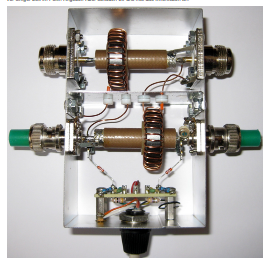
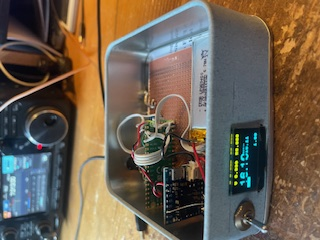
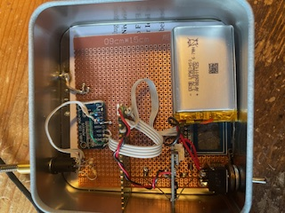

# Power & SWR Meter mit ADS1115 + OLED (MicroPython)

Dieses Projekt ist ein kompaktes HF-Leistungsmessgerät basierend auf einem ADS1115 ADC, SSD1306 OLED und Kalibrierungstabellen.
Es misst die Vorwärts- und Rücklaufleistung und zeigt SWR und Watt auf einem OLED an – mit AutoRange, Peak-Hold und SWR-Warnung.

---

## 🔧 Hardware

- ADS1115 (16 Bit ADC)
- SSD1306 OLED (128x64)
- HF-Richtkoppler (z. B. Spannungsteiler + Gleichrichter) wie z.B Stockton-Messbrücke von DG1KPN 
- Microcontroller (z. B. Raspberry Pi Pico)
- Optional: Taster für Kalibrierung / Bereichsumschaltung







- Beispiel -> Stockton-Messbrücke von DG1KPN
- mein HW Aufbau PICO OLED ADS1115 und Accu in der Dose DL2DBG
- es geht auch einfach DL2DBG

 ## Hinweis  
 Die Schaltung ist **isoliert von der "normalen" Masse** aufgebaut.  
 Daher erfolgt die Stromversorgung **über eine Batterie**.  
 Die **Kopplung der Messbrücke** mit dem **AD-Wandler** (A0_3, A1_3,z.b. ADS1115_COMP_0_3)  
 erfolgt als **differenzielle Messung** mit separatem Ground.
 Wenn man den Aufbau **nicht isoliert** oder **unsymmetrisch** umsetzt,  
 können sich **parasitäre Spannungen** einstellen.  
 Dadurch kann z. B. die **Reflektion nicht auf Null** gehen,  
 und das **SWR (Stehwellenverhältnis)** zeigt dann **fälschlicherweise Werte größer als 1.1**,  
 obwohl die reale Anpassung in Ordnung wäre.


## ⚙️ Features

- ✅ Messung von Vorwärts- und Rücklaufleistung (z. B. AIN0-AIN3, AIN1-AIN3)
- ✅ Automatische Bereichserkennung (AutoRange für optimalen Gain)
- ✅ SWR-Berechnung + Return Loss
- ✅ Peak-Hold für Leistung & SWR (einstellbar)
- ✅ OLED-Darstellung:
  - Balkenanzeige für Leistung
  - Balkenanzeige in Stufen für SWR
  - Großschrift für Wattanzeige (`freesans30`)
- ✅ Kalibrierung per JSON-Datei (linear interpoliert)
- ✅ JSON-basierte Speicherfunktion

---

## 📦 Dateien

| Datei              | Beschreibung                             |
|--------------------|------------------------------------------|
| `main_autorange.py`| Hauptprogramm mit AutoRange aktiviert    |
| `cal_1w.json`      | Beispiel-Kalibriertabelle (optional)     |
| `freesans30.py`    | Große Schrift für OLED (externe Font)    |

Die anderen Python Programme sind zum Test.---

## 🧠 Beispiel: Kalibriertabelle

## 💬 Feedback
Der gesamte Aufbau ist eine **kleine Übung für mich selbst**,  
Daher ist die Dokumentation aktuell noch **recht mager gehalten**.  
Sollte jedoch Interesse am **Nachbau** oder an neuen  **Funktionen** bestehen,   
freue ich mich über **Rückmeldungen**.  
Auch **konstruktive Hinweise oder Verbesserungsvorschläge** sind jederzeit willkommen!

```json
[
  [2.0, 1.0],
  [6.32, 10.0],
  [20.0, 100.0]
]
```

→ Spannung (V) → Leistung (W)  
Wird automatisch sortiert & interpoliert.

---

## 📈 AutoRange

AutoRange misst zunächst auf dem kleinsten Gain (±6.144 V) und passt automatisch auf ±4.096, ±2.048 V usw. an, bis die Auflösung optimal ist.

---

## 🧪 OLED-Anzeige

- Leistung in Großschrift
- Balkenanzeige für aktuelle Watt
- SWR-Stufenbalken (1.0–5.0)
- Fehleranzeige bei SWR > Limit
- Anzeige von Gain (optional aktivierbar)


🔁 Messkette einmal **komplett durchrechnen**:

Die ganze Messkette einmal **komplett durchrechnen**, von der **HF-Leistung (100 W)** über den **Richtkoppler (2,8 V DC-Ausgang)** bis zum **ADC-Wert im ADS1115** – inklusive Umrechnung und Auflösung. 

------

## 🔁 Gesamtstrecke:

> **HF-Leistung → Richtkoppler → DC-Spannung (2,8 V) → ADS1115 → Digitalwert**

------

## 🧱 Gegeben:

- **Maximale HF-Leistung:** 100 W
- **DC-Spannung bei 100 W:** 2,80 V
- **ADC: ADS1115, 16 Bit, Gain = 1** → Messbereich ±4.096 V
- **LSB (Spannungsauflösung):** 0.125 mV = 0.000125 V

------

## 🧮 Schritt 1: HF-Leistung → DC-Spannung

Der Richtkoppler erzeugt eine Spannung, die proportional zur **Wurzel der Leistung** ist:

VDC=a⋅PHFV_{\text{DC}} = a \cdot \sqrt{P_{\text{HF}}}

Bei 100 W → 2,8 V
 → Umstellen:

a=VP=2.8100=2.810=0.28a = \frac{V}{\sqrt{P}} = \frac{2.8}{\sqrt{100}} = \frac{2.8}{10} = 0.28

Die allgemeine Formel:

V=0.28⋅P⇔P=(V0.28)2V = 0.28 \cdot \sqrt{P} \quad \Leftrightarrow \quad P = \left(\frac{V}{0.28}\right)^2

------

## 🧮 Schritt 2: DC-Spannung → ADC-Wert

ADS1115, Gain = 1 → ±4.096 V → 16-Bit Bereich = ±32768
 (also 1 LSB = 0.125 mV)

Jetzt berechnen wir den ADC-Wert bei 2.8 V:

ADC-Wert=2.8 V0.000125 V=22.400\text{ADC-Wert} = \frac{2.8\,\text{V}}{0.000125\,\text{V}} = 22.400

→ Das ist dein digitaler Wert bei 100 W Leistung.

------

## 🧮 Schritt 3: ADC-Wert → zurück zu HF-Leistung

Du misst z. B. mit ADS1115: **ADC = 16.000**

→ Umrechnen in Spannung:

V=16000⋅0.000125=2.000 VV = 16000 \cdot 0.000125 = 2.000\,\text{V}

→ In HF-Leistung zurückrechnen:

P=(2.00.28)2=(7.14)2≈51.0 WP = \left(\frac{2.0}{0.28}\right)^2 = \left(7.14\right)^2 ≈ 51.0\,\text{W}

------

## ✅ Fazit – Messkette (100 W Beispiel):

| Stufe                   | Wert                      |
| ----------------------- | ------------------------- |
| HF-Leistung             | 100 W                     |
| DC-Ausgang Richtkoppler | 2.80 V                    |
| ADS1115 (Gain=1)        | 22.400 Schritte           |
| Auflösung bei 2.8 V     | ca. **6.25 mW / Schritt** |


---

## 📜 Lizenz

MIT License – freie Nutzung mit Namensnennung

---

> Projekt von [Uli DL2DBG] – inspiriert durch echte HF-Messpraxis 🔧📡
> Ich danke meinem neuen Mitarbeiter chatgpt  :-) 🔧📡
